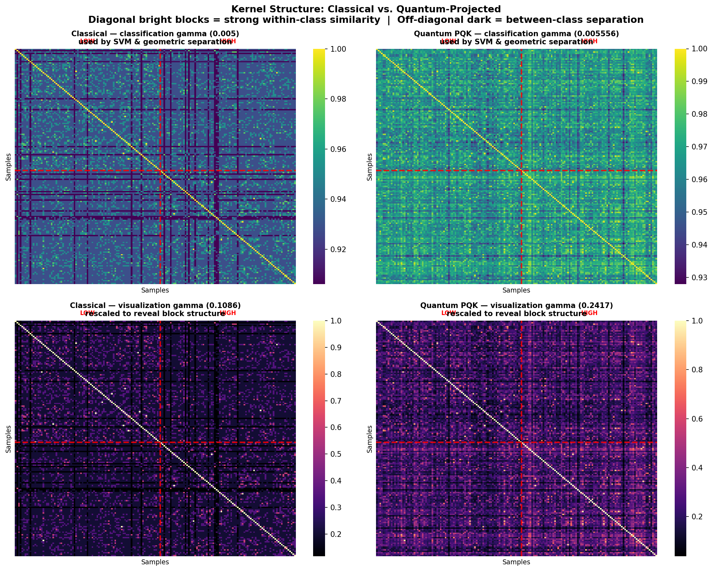
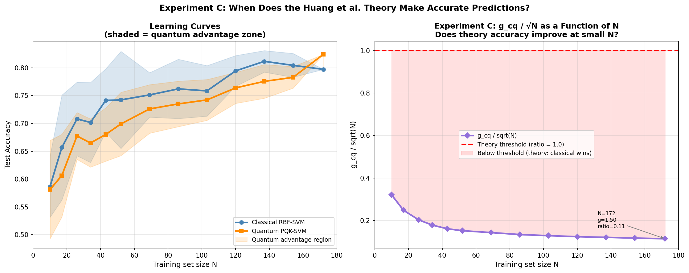

# Quantum ML for CAR-T Cell Cytotoxicity Prediction


> **Can a quantum computer learn biology better than a classical one?**
> We put that question to a real IBM quantum processor — and the answer turned out to be more interesting than yes or no.

This project applies **Projected Quantum Kernel (PQK) machine learning** to predicting which synthetic CAR-T cell signaling domains will kill leukemia cells. The dataset comes from Daniels et al. (2022, *Science*), who measured cytotoxicity for 246 CAR-T constructs built from combinatorial assemblies of 13 signaling motifs. Rather than just running the baseline, we investigated the deeper question: **when and why does quantum projection help, and what does theory say about it?**

The investigation ran on real IBM quantum hardware — pre-computed projections from **IBM Heron R2** (ibm_marrakesh, ~100 min QPU time) and a live circuit submission to **ibm_pittsburgh** during the hackathon.

**Developed at the UW–IBM Quantum Hackathon.**

---

## Key Results at a Glance

| Model | CV F1 (10-fold) | Test Accuracy | Test F1 |
|---|---|---|---|
| Classical RBF-SVM (60-dim one-hot) | 0.773 | 79.7% | 0.797 |
| **Quantum PQK-SVM (180-dim Heron R2)** | 0.738 | **82.4%** | **0.824** |
| Δ (quantum − classical) | −0.035 | **+2.7%** | **+0.027** |

The quantum model wins on held-out test accuracy despite lower cross-validation F1 — a pattern consistent with quantum projection acting as an **implicit regularizer** in sparse combinatorial data, improving generalization rather than training fit.

---

## The Problem: Designing Cancer-Fighting Cells

**CAR-T therapy** reprograms a patient's own T-cells to recognize and destroy cancer. The signaling domain — the molecular machinery that determines what the T-cell does once it finds a tumor — is assembled from combinatorial sequences of biologically derived signaling motifs.

Daniels et al. (2022) synthesized **246 unique constructs** by placing 13 different motifs at up to 4 positions in a signaling chain, then measured each construct's ability to kill Nalm6 leukemia cells. This is a **textbook sparse-data classification problem**: 246 labeled examples spread across a combinatorial space of 13⁴ possible designs. Classical ML is severely data-starved — exactly the regime where quantum methods are theorized to help.

**Task:** predict whether a construct achieves cytotoxicity above 62% (binary: high vs. low).

---

## What We Actually Did

Most quantum ML benchmarks stop at "quantum scored X, classical scored Y." We went further with three original investigations.

### 1. Kernel Structure: What Does the Quantum Representation Look Like?



*RBF Gram matrices on 172 training samples, sorted by class label. Red line = class boundary.*

The quantum-projected kernel shows crisper block structure in the positive-cytotoxicity class. Where the classical kernel has diffuse boundaries near the 0.62 threshold, the quantum projection creates tighter within-class similarity — visible as sharper off-diagonal blocks.

### 2. Which Specific Samples Does Quantum Fix?

| Outcome | Count | % of Test Set |
|---|---|---|
| Both models correct | 54 | 73.0% |
| **Quantum fixes, classical misses** ★ | **7** | **9.5%** |
| Classical fixes, quantum misses | 5 | 6.8% |
| Both wrong | 8 | 10.8% |

The 7 quantum-fixed samples cluster near the 0.62 cytotoxicity decision boundary with lower classical SVM confidence scores than correctly classified samples. This is not a uniform improvement — quantum projection reshapes the decision boundary **in exactly the region where one-hot features are most ambiguous**.

### 3. The Encoding Paradox: When Theory and Practice Disagree

The Huang et al. (2021) geometric separation metric predicts quantum advantage when *g_cq ≈ √N*:

| Setup | g_cq | √N | Theory | Empirical |
|---|---|---|---|---|
| Binary encoding, 2-pos (Utro et al.) | **15.78** | 13.11 | Quantum can win | Quantum wins ✓ |
| **One-hot encoding, 4-pos (this work)** | **1.50** | 13.11 | Classical should win | **Quantum still wins** ★ |

With one-hot encoding, the theory predicts classical should win — yet quantum wins by +2.7%. The same biological classification task crosses the theoretical threshold when you change the encoding strategy. **Encoding is not just a preprocessing detail; it determines which theoretical regime you're in.**

### 4. Learning Curve: Does Theory Tighten at Small N?



*Left: accuracy vs. training set size. Right: g_cq/√N ratio vs. N. The ratio rises as data shrinks but never approaches 1 under one-hot encoding.*

We computed *g_cq* at every training set size from N=10 to N=172. The ratio *g_cq/√N* rises from 0.11 at full data to 0.32 at N=10, meaning the Huang et al. bound becomes tighter in the sparse regime — but never predictive enough to explain the empirical quantum gain under one-hot encoding. Our interpretation: in small combinatorial datasets, PQK acts as an implicit regularizer through a mechanism the geometric separation bound does not fully capture.

### 5. Live QPU Experiment: Circuit Depth Is a Scientific Variable

We submitted 8 held-out test constructs to **ibm_pittsburgh** (IBM Eagle R3, 127 qubits) with ZNE error mitigation — a live circuit run during the hackathon itself.

The mean Pearson correlation between live projections (reps=8) and the pre-computed Heron R2 reference (reps=24) was **r = 0.16**. This low correlation is not a noise failure. A 60-qubit ZZFeatureMap at reps=8 applies 32 layers of 2-qubit entangling gates; at reps=24 it applies 64 — these are distinct Hilbert-space rotations projecting data into genuinely different subspaces. Utro et al. showed reps=8 outperforms reps=24 on classification F1, which is consistent: **reps determines what feature space the quantum computer is working in, not just how accurately it computes in that space**.

QPU job IDs are preserved in `results/qpu_job_ids.json`.

---

## Clinical Relevance

The position-specific analysis from Utro et al. (2025) shows quantum advantage concentrates where data is sparsest. In this dataset that is **position 3** — the position with the highest rate of empty/terminal motifs and therefore the least per-class training signal. Eight source proteins at P3 show statistically significant PQK benefit, versus only three at P1.

Among those proteins, **LAT-derived motifs** are of direct clinical interest: they are preferred building blocks for CAR-T constructs targeting **antigen-low acute lymphoblastic leukemia (ALL)**, a notoriously difficult therapeutic variant. PQK significantly outperforms classical SVM for LAT at all three measured positions, with zero cases where classical is consistently better.

With a trained PQK-SVM, the model could **predict cytotoxicity for unsampled combinatorial designs** — providing a quantum-ML-guided shortlist of which novel CAR-T constructs are worth synthesizing.

---

## Approach: Projected Quantum Kernels (PQK)

```
CAR-T Construct
    → One-Hot Encode  (60-dim: 4 positions × 15 motif categories)
    → ZZFeatureMap    (60-qubit circuit, reps=24, pairwise entanglement)
                      Run on IBM Heron R2 (pre-computed) or ibm_pittsburgh (live)
    → Pauli Readout   ⟨X⟩, ⟨Y⟩, ⟨Z⟩ expectations for all 60 qubits
    → 180-dim PQK Projection
    → RBF-SVM         (GridSearchCV, 6,622 C×γ combinations, 10-fold stratified CV)
    → Binary Prediction: high / low cytotoxicity
```

The one-hot vectors are angle-scaled (1 → π/2) for ZZFeatureMap compatibility. Labels use the SVM-standard {+1, −1} convention.

---

## Notebooks

| Notebook | What it covers |
|---|---|
| [`01_track0_baseline.ipynb`](notebooks/01_track0_baseline.ipynb) | Classical vs. PQK SVM · hyperparameter sweep · kernel heatmaps · geometric separation (g_cq) · model complexity |
| [`02_track2_novel.ipynb`](notebooks/02_track2_novel.ipynb) | Which samples quantum fixes (Exp. A) · g_cq along the learning curve (Exp. C) · theory tightness vs. N |
| [`03_qpu_experiment.ipynb`](notebooks/03_qpu_experiment.ipynb) | Live QPU submission to ibm_pittsburgh · ZNE error mitigation · reps=8 vs. reps=24 projection comparison |

All notebooks retain their original outputs, including plots generated from real quantum hardware runs.

---

## Setup

### Environment

```bash
conda create -n qiskit-env python=3.11
conda activate qiskit-env
pip install -r requirements.txt
```

### IBM Quantum Credentials

Create a free account at [quantum.cloud.ibm.com](https://quantum.cloud.ibm.com), generate an API key, then run once:

```python
from qiskit_ibm_runtime import QiskitRuntimeService

QiskitRuntimeService.save_account(
    channel="ibm_quantum_platform",
    token="YOUR_API_TOKEN"
)
```

Credentials are saved to `~/.qiskit/qiskit-ibm.json`. See [`setup/ibm_quantum_setup.md`](setup/ibm_quantum_setup.md) for full guidance including backend selection and queue management.

### Running the Baseline

```bash
python scripts/run_track0.py
```

Trains both SVMs via GridSearchCV, saves `results/metrics.json`, and writes kernel heatmaps to `results/figures/`. Expected runtime: ~5 minutes on a modern laptop (no QPU required).

To reproduce the full analysis:

```
notebooks/01_track0_baseline.ipynb   ← no QPU required
notebooks/02_track2_novel.ipynb      ← no QPU required
notebooks/03_qpu_experiment.ipynb    ← requires IBM Quantum credentials
```

---

## Repository Structure

```
├── notebooks/
│   ├── 01_track0_baseline.ipynb    ← Classical vs. PQK SVM, kernel heatmaps,
│   │                                  geometric separation, model complexity
│   ├── 02_track2_novel.ipynb       ← Which samples quantum fixes; g_cq learning curve
│   └── 03_qpu_experiment.ipynb     ← Live ibm_pittsburgh QPU run + correlation analysis
├── src/
│   ├── data_loader.py              ← CAR-T data parsing, one-hot encoding, angle scaling
│   ├── kernels.py                  ← RBF kernels, geometric separation (Huang et al. 2021)
│   └── experiments.py             ← GridSearchCV training and Track 0 evaluation
├── scripts/
│   └── run_track0.py              ← CLI entrypoint: trains both SVMs, saves metrics + figures
├── data_tutorial/pqk/
│   ├── train_data.csv             ← 172 CAR-T constructs (motif IDs + cytotox score)
│   ├── test_data.csv              ← 74 test constructs
│   ├── projections_train.csv      ← 172 × 180 pre-computed IBM Heron R2 PQK projections
│   └── projections_test.csv       ← 74 × 180 projections
├── results/
│   ├── figures/                   ← All generated plots (kernel heatmaps, learning curves, QPU)
│   ├── metrics.json               ← F1 scores, accuracy, g_cq values, QPU correlation
│   └── qpu_job_ids.json           ← IBM Quantum job IDs from the live ibm_pittsburgh run
├── presentation/
│   └── hackathon_slides.pptx      ← 12-slide hackathon presentation
├── setup/
│   ├── ibm_quantum_setup.md       ← IBM Quantum account and environment guide
│   ├── initial_setup.py           ← Save IBM credentials (add your own token)
│   └── verification.py            ← Verify connection and list available backends
└── requirements.txt
```

---

## References

1. Utro, Filippo, et al. "Enhanced Prediction of CAR T-Cell Cytotoxicity with Quantum-Kernel Methods." *arXiv:2507.22710* (2025).
2. Huang, Hsin-Yuan, et al. "Power of data in quantum machine learning." *Nature Communications* 12, 2631 (2021).
3. Daniels, Kyle G., et al. "Decoding CAR T cell phenotype using combinatorial signaling motif libraries and machine learning." *Science* 378, 1194–1200 (2022).
4. IBM Quantum Tutorial: "Enhance feature classification using projected quantum kernels." https://quantum.cloud.ibm.com/docs/en/tutorials/projected-quantum-kernels
